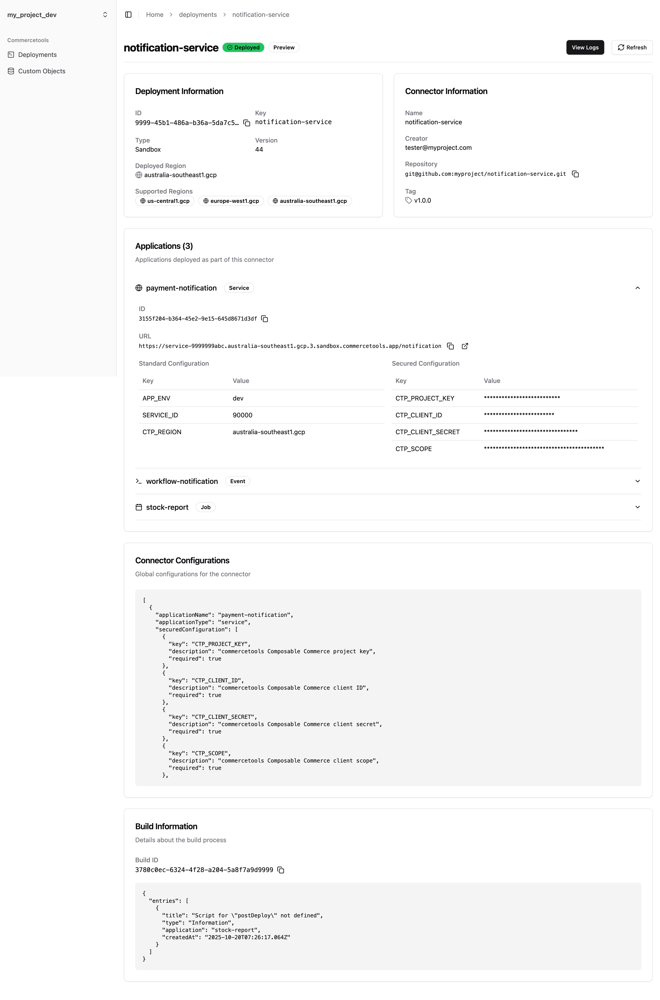
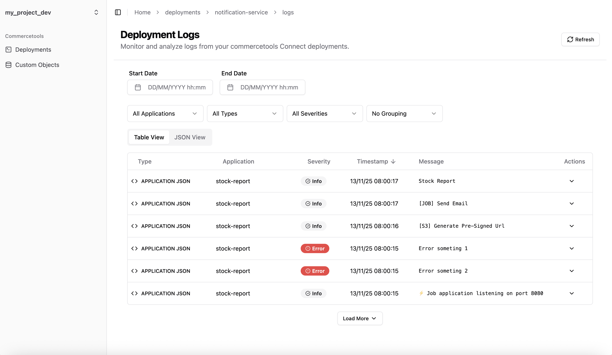
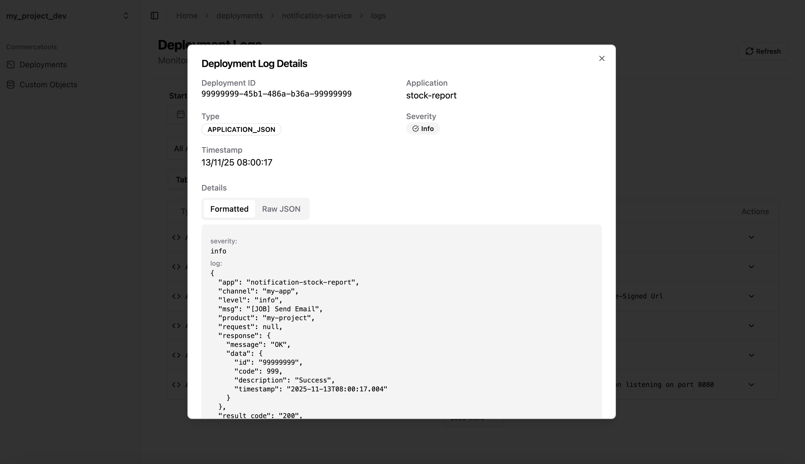
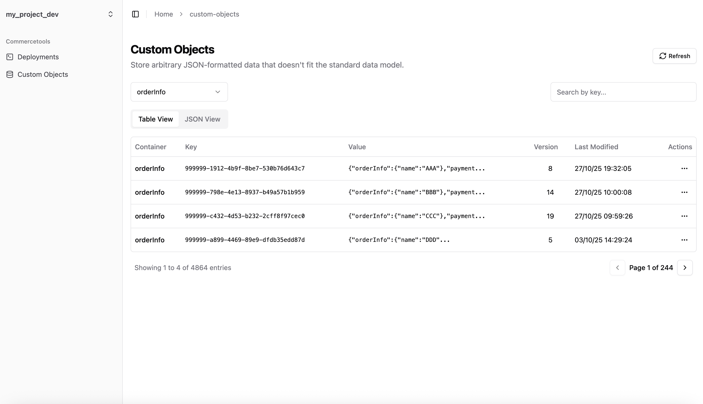
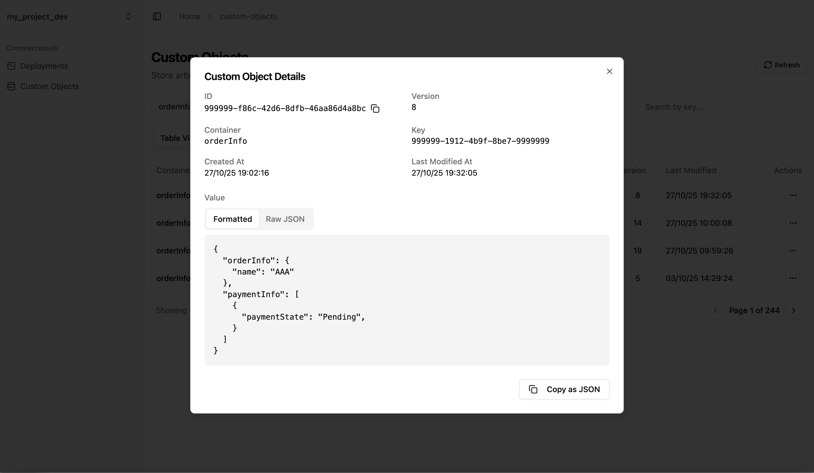

# Commercetools Logs Dashboard

## Overview
Commercetools Logs Dashboard is a web application designed to visualize and analyze logs from Commercetools. It provides an intuitive interface for filtering, searching, and monitoring logs, making it easier to diagnose issues and track system performance.

## Features
- **Log Visualization:** View logs in a structured and easy-to-read format.
- **Filtering & Searching:** Search logs based on various criteria such as timestamp, severity, and keywords.
- **User-Friendly Interface:** A responsive and interactive dashboard for seamless user experience.

## Screenshots













## Tech Stack
- React, TypeScript, NextJS, Tailwind CSS, React Query, shadcn/ui, and more.

## Installation

### Prerequisites
Ensure you have the following installed:
- Node.js (preferably using Bun runtime)
- npm / bun
- Commercetools API credentials

### Steps
1. Clone the repository:
   ```sh
   git clone https://github.com/amornpic/commercetools-logs-dashboard.git
   cd commercetools-logs-dashboard
   ```
2. Install dependencies:
   ```sh
   bun install
   ```
3. Set up environment variables:
   Create a `.env` file in the root directory and add the required Commercetools API credentials.
   ```env
    CT_API_URL=your_api_url
    CT_REGION=your_region
    CT_PROJECT_KEYS=your_project_key_dev,your_project_key_uat
    CT_CLIENT_IDS=your_client_id,your_client_id
    CT_CLIENT_SECRETS=your_client_secret,your_client_secret
    CT_SCOPES=your_scopes
   ```
   
   Note: You can specify multiple project keys in the `CT_PROJECT_KEYS` variable by separating them with commas. This allows you to switch between different environments (e.g., development and UAT) using the environment switcher in the application.
4. Start the development server:
   ```sh
   bun run dev
   ```

## Usage
- Open `http://localhost:3000` in your browser.
- Configure filters to view specific logs.
- Use the search functionality to find relevant log entries.

## Deployment
To deploy the application, you can use Vercel, Cloudflare Pages, or any cloud provider of your choice. Example deployment command with Vercel:
```sh
vercel deploy
```

## Contributing
Contributions are welcome! Please follow these steps:
1. Fork the repository.
2. Create a new branch (`feature-branch`).
3. Commit your changes.
4. Open a pull request.

## License
This project is licensed under the MIT License.

## Contact
For any inquiries, please reach out via GitHub issues or email at [amornpic09@gmail.com].

